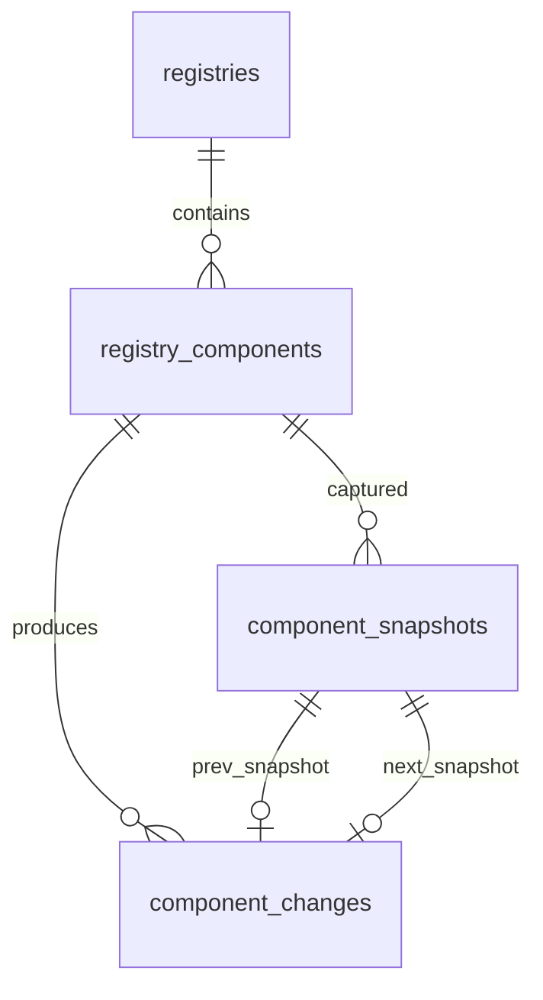

# Registry data model

This document captures the storage plan for tracking registries, their components, and the append‑only history that backs fetchers, the diff engine, and downstream UI/webhook consumers.

## Goals

- keep `registries` as the source of truth for the catalog itself
- store the latest component state in a queryable table for UI (`registry_components`)
- preserve every fetch result as an immutable snapshot (`component_snapshots`)
- describe diffs/alert-worthy events in an append-only log (`component_changes`)
- make it easy to hydrate watchlists, RSS feeds, and webhooks from the same primitives

## Storage strategy

1. **Fetchers** ingest raw registry exports, normalize component metadata, and compute a content checksum (e.g., SHA256 of concatenated files).
2. If the checksum differs from the current `registry_components.checksum`, we insert a new row in `component_snapshots`. Snapshots are immutable and deduplicated with the `(component_id, checksum)` unique index.
3. We derive a human-meaningful change by diffing the new snapshot against the previous one and insert an entry into `component_changes`. The log references both `prev_snapshot_id` and `next_snapshot_id` so we can render diffs later.
4. The "latest state" for UI/watchlists simply lives in `registry_components` (`first_seen_at`/`last_seen_at` track lifecycle), so consumers do not have to join against snapshots on every read.

This pattern (mutable projection + append-only history) lets us rewind time, recompute aggregates, and audit diff logic without lossy updates.

## Entity relationship diagram



## Table reference

### `registries`

Existing table, still the canonical catalog of shadcn registries. Key columns used by the new data model:

| Column | Notes |
| --- | --- |
| `id` | surrogate key used everywhere else |
| `name`, `homepage`, `url`, `utm_source` | human metadata + attribution |
| `has_feed`, `rss_url`, `fetched_at` | still leveraged by the cron fetchers |

### `registry_components`

| Column | Purpose |
| --- | --- |
| `registry_id` | FK to `registries`, cascades on delete |
| `slug` | stable component identifier inside a registry (unique per registry) |
| `kind` | component/block/pattern/etc (string enum, defaults to `component`) |
| `status` | lifecycle indicator (`active`, `deprecated`, `removed`) |
| `checksum` | hash of the latest recorded snapshot, used to skip redundant work |
| `source_path` / `source_url` | where fetchers pulled the current files from |
| `metadata` | JSON blob (stored as text) for registry-specific details |
| `first_seen_at` / `last_seen_at` | timestamps for lifecycle analytics |

`registry_components` is the table UI code should query for "current state". Updates to this table happen only after a new snapshot is accepted.

### `component_snapshots`

Append-only ledger of component states. Important columns:

| Column | Purpose |
| --- | --- |
| `component_id` / `registry_id` | redundancy keeps queries simple and enables pruning per registry |
| `checksum` | deduplicates identical payloads |
| `version_label` | optional label (git tag, semantic version, date) to display in UI |
| `source_commit` / `source_tag` | capture upstream git metadata for reproducibility |
| `files` | JSON (text) describing files included in the snapshot (path, hash, size) |
| `metadata` | scraper-specific data; e.g., parsed front-matter |
| `captured_at` | when the snapshot was ingested |

### `component_changes`

Event log of derived changes. Recommended conventions:

| Column | Purpose |
| --- | --- |
| `change_type` | machine-friendly code such as `component.added`, `component.modified`, `component.removed`, `component.renamed`, `metadata.changed` |
| `severity` | `info`, `minor`, `major`, `breaking` (feed/webhook filters can use this) |
| `is_breaking` | boolean shortcut derived from severity |
| `summary` / `description` | human readable context |
| `diff` | JSON string (git diff, JSON Patch, or custom structure) |
| `prev_snapshot_id` / `next_snapshot_id` | allow on-demand diff reconstruction |
| `detected_at` / `published_at` | track when fetcher saw the change vs. when we notified subscribers |

Two covering indexes keep the log queryable for both "latest events per registry" and "timeline for a single component".

## Example records

Sample inserts demonstrating the end-to-end flow:

```sql
-- 1. registry catalog entry
INSERT INTO registries (id, name, homepage, url, description, created_at)
VALUES (1, 'Acme Registry', 'https://acme.dev', 'https://acme.dev/r/components', 'Community maintained registry', strftime('%s','now'));

-- 2. stable component row
INSERT INTO registry_components (
  registry_id, slug, name, kind, status, checksum,
  source_path, source_url, metadata, first_seen_at, last_seen_at, created_at, updated_at
) VALUES (
  1, 'command-menu', 'Command Menu', 'component', 'active', 'sha256:abc123',
  'apps/registry/command-menu.tsx', 'https://github.com/acme/registry/blob/main/command-menu.tsx',
  json('{"tags":["navigation","command"]}'),
  strftime('%s','now'), strftime('%s','now'), strftime('%s','now'), strftime('%s','now')
);

-- 3. immutable snapshot
INSERT INTO component_snapshots (
  component_id, registry_id, checksum, version_label, source_commit, files, metadata, captured_at, created_at
) VALUES (
  1, 1, 'sha256:abc123', '2025-12-01-fetch', '7c9f13b',
  json('[{\"path\":\"command-menu.tsx\",\"hash\":\"sha1:...\",\"size\":4212}]'),
  json('{\"props\":{\"variants\":3}}'),
  strftime('%s','now'), strftime('%s','now')
);

-- 4. derived change log entry
INSERT INTO component_changes (
  registry_id, component_id, change_type, severity, is_breaking,
  prev_snapshot_id, next_snapshot_id, summary, diff, metadata, detected_at, created_at
) VALUES (
  1, 1, 'component.modified', 'minor', 0,
  NULL, 1,
  'Command Menu gained multi-tenant prop support',
  json('{\"addedProps\":[\"tenantId\"],\"removedProps\":[]}'),
  json('{\"breaking\":false}'),
  strftime('%s','now'), strftime('%s','now')
);
```

These records are intentionally explicit about timestamps so migrations/tests can seed deterministic data.

## Operational notes

- **Fetch scheduling**: `cron/registries` can continue to hydrate `registries` and now branches into `registry_components` + `component_snapshots`.
- **Diff engine**: compare the latest snapshot per component to the previous one (ordered by `captured_at`) to build entries in `component_changes`.
- **Derived products**: activity feeds query `component_changes` with optional severity filters; registry overview pages join `registries` → `registry_components` for the latest picture; historical timelines use `component_snapshots`.
- **Cleaning up**: because everything is keyed by `registry_id`, cascading deletes cleanly remove components, snapshots, and changes if we ever drop a registry.

This schema is now encoded in `db/schema.ts` and `db/migrations/0009_registry_data_model.sql`, so it is ready for immediate use by fetchers, diff jobs, and UI renderers.
